<picture>
  <source media="(prefers-color-scheme: dark)"  srcset="banner-dark.svg">
  <source media="(prefers-color-scheme: light)" srcset="banner-light.svg">
  
</picture>

 

<picture>
  <source media="(prefers-color-scheme: dark)"  srcset="tagline-dark.svg">
  <source media="(prefers-color-scheme: light)" srcset="tagline-light.svg">
  
</picture>

 

&nbsp;&nbsp;
&nbsp;&nbsp;

---

## This is me :)

Hi, I'm **Ayush**, a DevOps and cloud engineer based in Bengaluru 🇮🇳.
I keep production systems running and I automate the boring parts.

- 🏢 **Managed Services Consultant at Gresham Technology**: application support and data operations across client engagements.
- 🛠️ **Day to day:** incident investigation, Apache Airflow workflow support, CI/CD pipeline maintenance and cloud infrastructure support.
- ☁️ **Going deeper on:** AWS, Kubernetes, Terraform and GitOps.
- 🎓 **B.Tech in Computer Science** (2021–2025).
- 🌱 **Exploring:** Kubernetes internals, platform engineering, AI-assisted DevSecOps.
- 💬 Talk to me about **production support, Airflow and CI/CD pipelines**.

## my stack

---

## signals

<picture>
  <source media="(prefers-color-scheme: dark)"  srcset="radar-dark.svg">
  <source media="(prefers-color-scheme: light)" srcset="radar-light.svg">
  
</picture>

Self-rated, 1 to 5. Edit <code>assets/skills.json</code> and run <code>scripts/generate_assets.py</code> to redraw.

---

## hands-on repos

Repositories I use to practice specific tools:

| Focus | Repo |
|---|---|
| Kubernetes | [k9s](https://github.com/Ayush-Singh986/k9s) |
| Infrastructure | [terraform-ansible-multi-env](https://github.com/Ayush-Singh986/terraform-ansible-multi-env) |
| Backend + DevOps | [Springboot-BankApp](https://github.com/Ayush-Singh986/Springboot-BankApp) |
| Full stack + DevOps | [Wanderlust-Mega-Project](https://github.com/Ayush-Singh986/Wanderlust-Mega-Project) |

---

**Open to DevOps and Cloud roles.** Let's talk.

` built with care · Ayush Singh `

